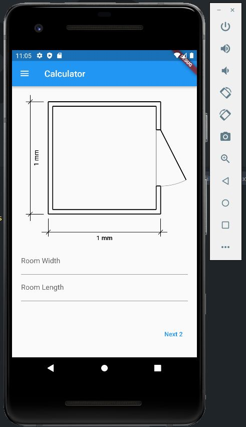
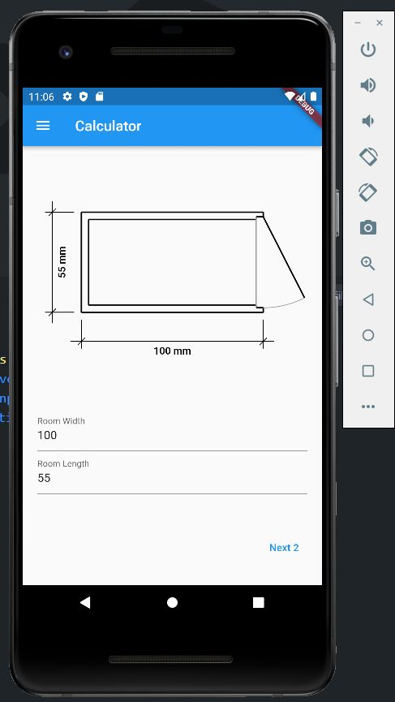
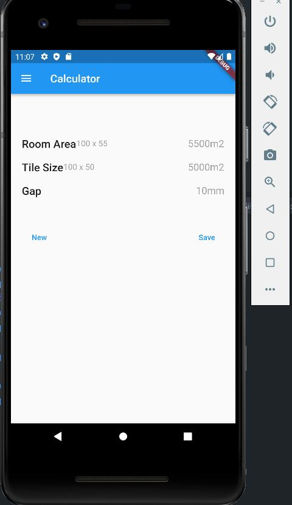

# Floor tile calculator - Free organizer for professional tilers

Goal is to learn how to create flutter android/ios apps, with custom drawing and state management.

## Calculators first page

Enter room dimensions

## Dynamic drawing proportional to the input

## Data overview (wip)

